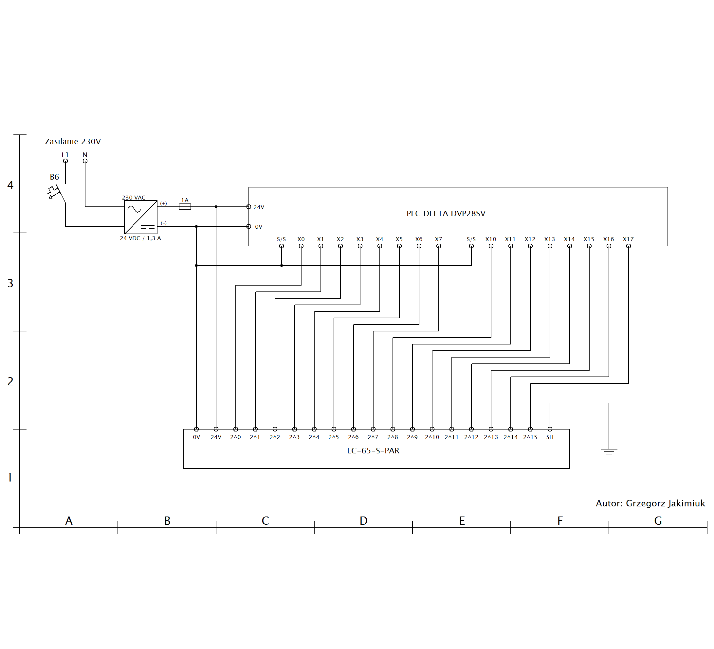
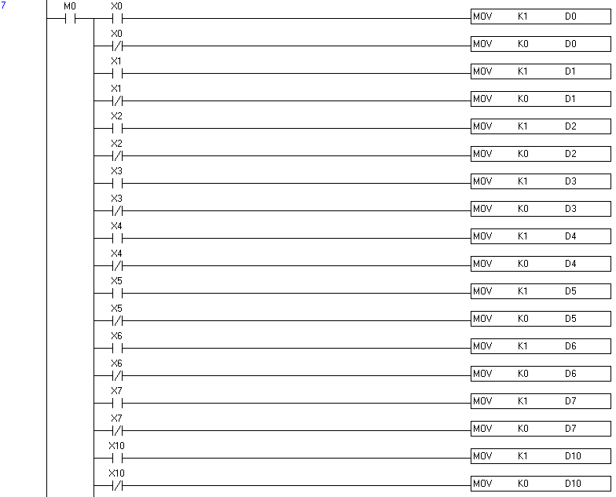
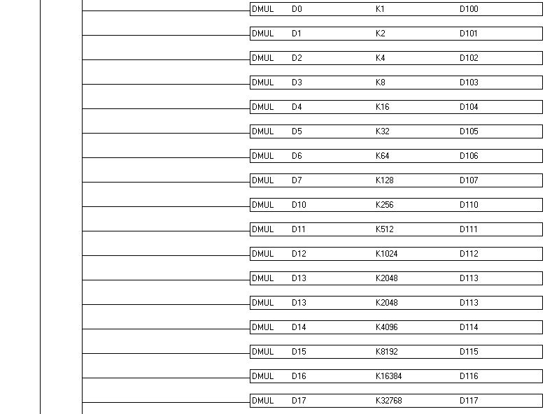
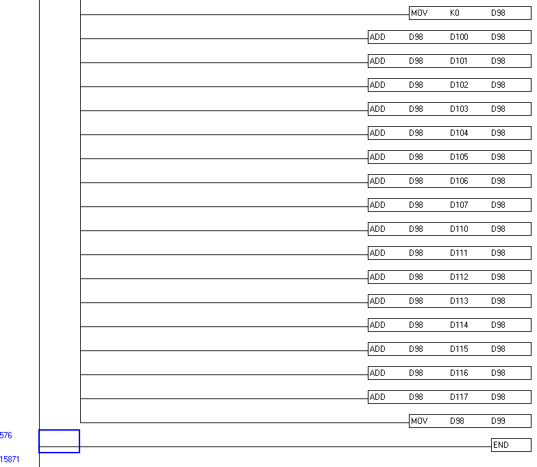

# PLC_Delta_Absolute_Encoder

Aplikacja służąca do odczytu obecnej pozycji enkodera absolutnego o rozdzielczości 16-bitów (65535 pozycji) przy pomocy sterownika PLC z serii Delta DVP28SV. Enkoder absolutny jest urządzeniem, który odczytuję aktualny kąt położenie wału np. silnika, jest wykorzystywany tam gdzie jest wymagana bardzo wysoka precyzja położenia. Enkodery absolutne posiadają wyjścia binarne, które dają informację o stanie położenia po wykonaniu kalkulacji sumy binarnej sygnałów, do odczytu tych sygnałów stosuje się sterowniki PLC, które posiadają dedykowane złącze typu LPT np. Siemens SIMATIC S5-95U. Ze względu na ogroniczenia sterownika DVP28SV, aplikacja tylko i wyłącznie odczytuję pozycję. Do celu aplikacji wykorzystano enkoder absolutny firmy TR Electronic Sweden AB z serii LC-65-S-PAR o napięciu sygnałów oraz zasilania 24V.

Wykorzystane rekwizyty:

•	Enkoder Absolutny LC-65-S-PAR
•	Sterownik PLC z serii Delta DVP28SV. 
•	Zasilacz 24V o mocy 30W. 
•	Wyłącznik instalacyjny B6 

Oznaczenie wejść/wyjść cyfrowych:

|Lp|	I/O|	Opis|
| --- | --- | --- |
|1|	X0|	LSb 2^0 bit|
|2|	X1|	2^1 bit|
|3|	X2|	2^2 bit|
|4|	X3|	2^3 bit|
|5|	X4|	2^4 bit|
|6|	X5|	2^5 bit|
|7|	X6|	2^6 bit|
|8|	X7|	2^7 bit|
|9|	X10|	2^8 bit|
|10|	X11|	2^9 bit|
|11|	X12|	2^10 bit|
|12|	X13|	2^11 bit|
|13|	X14|	2^12 bit|
|14|	X15|	2^13 bit|
|15|	X16|	2^14 bit|
|16|	X17|	2^15 bit|

Schemat elektryczny sterowania:

Sekcja inicjacyjna PLC:

Obsługa wejść:

Operacje arytmetyczne bitów:

Operacje sumowanie bitów:

Program pracuję w nieskończonej pętli, więc wynik pozycji będzie zapisywany w rejestrze danych D99 po wykonaniu sekwencji obliczeń arytmetycznych. Sterownik nie obsługuje sygnałów o wysokiej częstotliwości wejściowej, więc nie nadaje się do układów napędowych o wysokich obrotach wału, jedynie można wykorzystać w napędach wolnobieżnych. Dodatkowym ograniczeniem tego zastosowania jest moc obliczeniowa sterownika i jego szybkość kalkulacji arytmetycznej - w tym przypadku istnieje ryzyko, że pozycja wału nie będzie aktualizowana natychmiastowo. Innymi słowy aplikacja nie jest praktyczna zważywaszy na powyżej wymienione problemy oraz przez wykorzystanie wszystkich wejść cyfrowych na potrzeby enkodera absolutnego.
